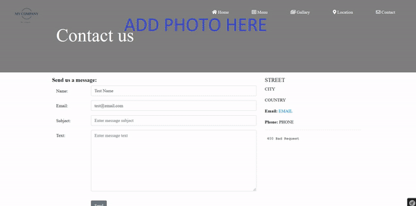
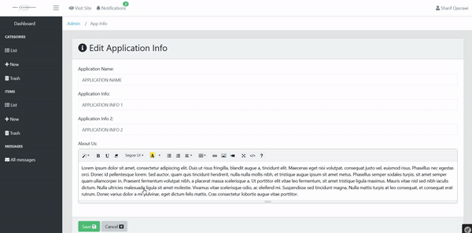

# cafe-bistro
Web application built using symfony 4 framework

# Database:
Create your MySQL database and run _bin/console make migration_ then _bin/console doctrine:migrations:migrate_.

## Don't forget to update your _.env file_

## Execute this query before running the app:

`INSERT INTO `system_settings` (`id`, `app_name`, `app_logo`, `app_info`, `address_street`, `address_city`, `address_country`, `email`, `phone`, `home_page_background`, `facebook_page_iframe`, `google_iframe`, `aboutus_image`, `aboutus_text`, `twitter_link`, `instagram_link`, `facebook_link`, `app_info2`, `login_page_background`, `is_first_run`, `menu_cover_height`, `menu_page_height`, `gallery_header_image`, `location_header_image`, `contact_header_image`, `location_longitude`, `location_latitude`) VALUES ('1', 'APPLICATION NAME', 'logo2-5de0527b1557a.png', 'APPLICATION INFO 1', 'STREET', 'CITY', 'COUNTRY', 'EMAIL', 'PHONE', 'b42iYx-5de19fd7f2b8b.png', 'EMBEDDED FACEBOOK PAGE IFRA%E', 'GOOGLE MAP IFRAME', 'addphoto-5de053655840f.png', 'Lorem ipsum dolor sit amet, consectetur adipiscing elit. Duis ut risus \r\nfringilla, blandit augue a, tincidunt elit. Maecenas eget nisi volutpat,\r\n consequat justo vel, euismod risus. Phasellus nec egestas orci. Donec \r\nid pellentesque lorem. Sed auctor, quam quis tincidunt hendrerit, nulla \r\nnulla mollis nibh, et tristique augue ipsum sit amet metus. Phasellus \r\nsemper sodales turpis, sit amet semper quam ullamcorper in. Praesent \r\nfermentum volutpat nibh, a placerat massa scelerisque a. Ut porttitor \r\nelit vitae leo fermentum, sit amet tristique ligula maximus. Mauris \r\nvitae nisl sed nibh iaculis dictum. Nulla ultricies malesuada ligula sit\r\n amet molestie. Vivamus vitae scelerisque odio, ac eleifend mi. \r\nSuspendisse sed tincidunt magna. Nulla mattis turpis at leo consequat, \r\net consequat erat rutrum. Donec varius dolor a mi pulvinar, eget dictum \r\nfelis mattis. Cras consectetur lobortis augue vitae porttitor.\r\n', 'TWITTER PAGE URL', 'INSTAGRAM PAGE URL', 'FACEBOOK PAGE URL', 'APPLICATION INFO 2', 'addphoto.png', '1', '700', '820', 'addphoto-5de0536ec7aaa.png', 'addphoto-5de053767f0e4.png', 'addphoto-5de0537e730af.png', '0', '0');`

### Now you can run your app:
#### Please notice that when accessing the admin page at first run the app allows you to create an admin user. 

# Demo:

**Demo Home Page:**

 

**Demo Admin Page:**

 

**Demo Admin Page (continued):**

 

## Important Notes:

* Add images instead of the "Add a photo" placeholder to customize the look of your website.

* User reset password not implemented yet.

* The Menu supports only 4 menus.

* Restaurant menu licenses:
> Created by Codrops
> License: http://tympanus.net/codrops/licensing/
> Background Pattern(s) from http://subtlepatterns.com/
> http://creativecommons.org/licenses/by-sa/3.0/deed.en_US
> normalize.css by Nicolas Gallagher: http://github.com/necolas/normalize.css
> Stone Pattern by AGF81:
http://agf81.deviantart.com/gallery/31629552#/d49w3l3

* Admin page layout by CoreUI
